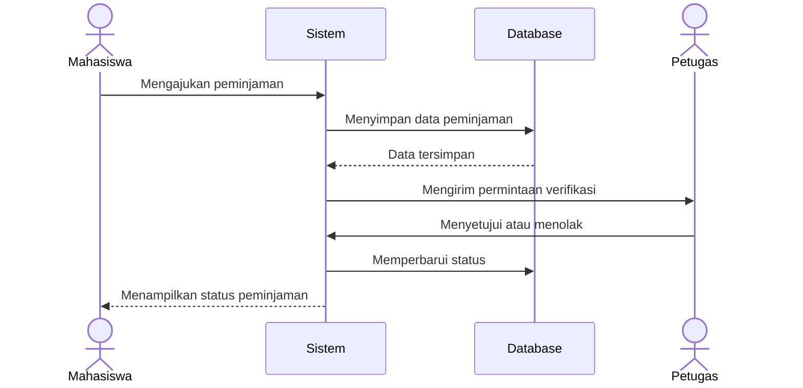

# Sequence Diagram Sistem Peminjaman Barang Laboratorium

```mermaid
sequenceDiagram
    actor Mahasiswa
    participant Sistem
    participant Database
    actor Petugas

    Mahasiswa->>Sistem: Mengajukan peminjaman
    Sistem->>Database: Menyimpan data peminjaman
    Database-->>Sistem: Data tersimpan
    Sistem->>Petugas: Mengirim permintaan verifikasi
    Petugas->>Sistem: Menyetujui atau menolak
    Sistem->>Database: Memperbarui status
    Sistem-->>Mahasiswa: Menampilkan status peminjaman
```
